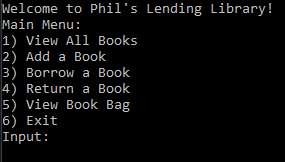
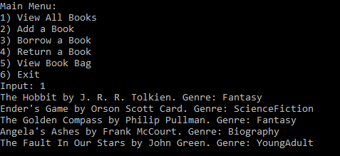
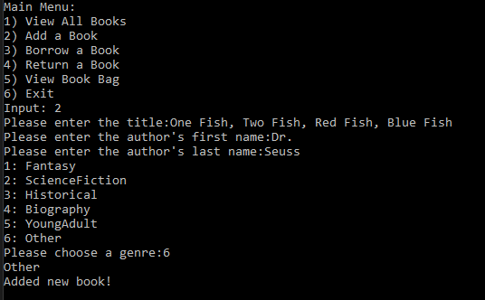
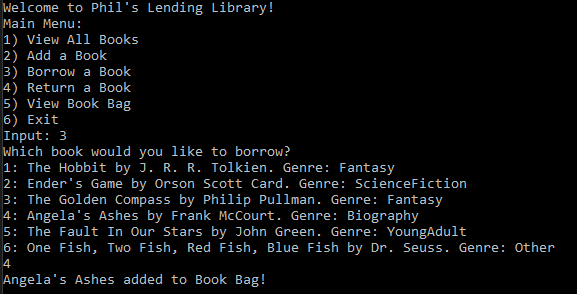
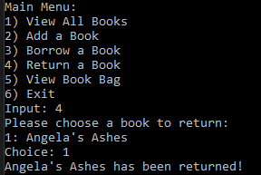

# Console Library

Lab07-Collections

*Author: Chris Cummings*

----

## Description
This is a psuedo library app. You can do several different functions with the library:
view all books in the library, add a book, rent a book, return a book.  Rented books get stored
in a collection, and returned books are added back to the library.

---

### Getting Started
Clone this repository to your local machine.

```
$ git clone https://github.com/cdcummings10/Lab07--Library.git
```

### To run the program from Visual Studio:
Select ```File``` -> ```Open``` -> ```Project/Solution```

Next navigate to the location you cloned the Repository.

Double click on the ```Lab07--Library``` directory.

Then select and open ```Library.sln```

Click on ```Start```

### To run the executable:

Navigate to folder ```Lab07--Library``` directory.

Navigate through these folders: ```Library``` => ```Library``` => ```bin``` => ```Debug```

Run ```Library.exe```

---

### Visuals

#### Application Start

#### View List of Books in Library

#### Adding a Book

#### Borrow a Book

#### Returning a Book

#### View List of Books in Book Bag


---

### Time Estimates
Estimated time to finish: 5 Hours

Actual time to finish: 6 Hours

### Change Log 

1.0: *Finished Library Application. Added all functionality to app.* - 23 Oct 2019
